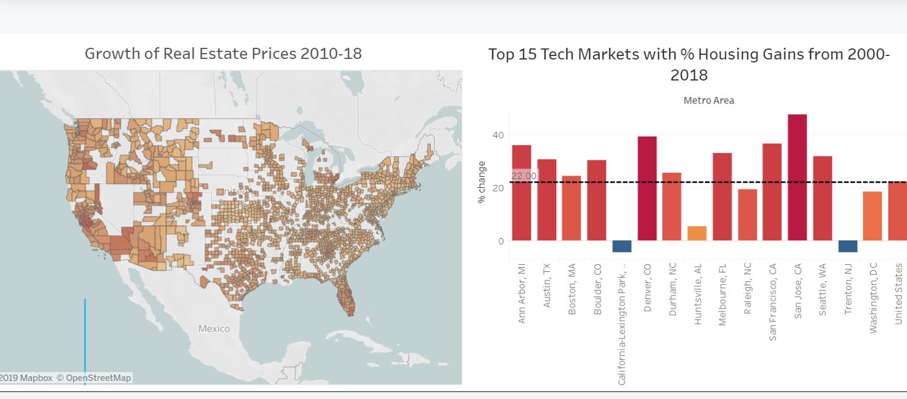
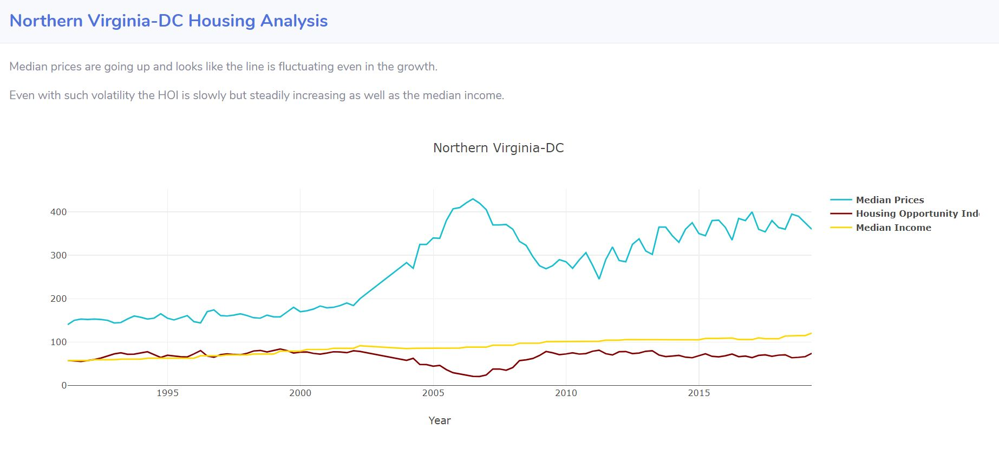
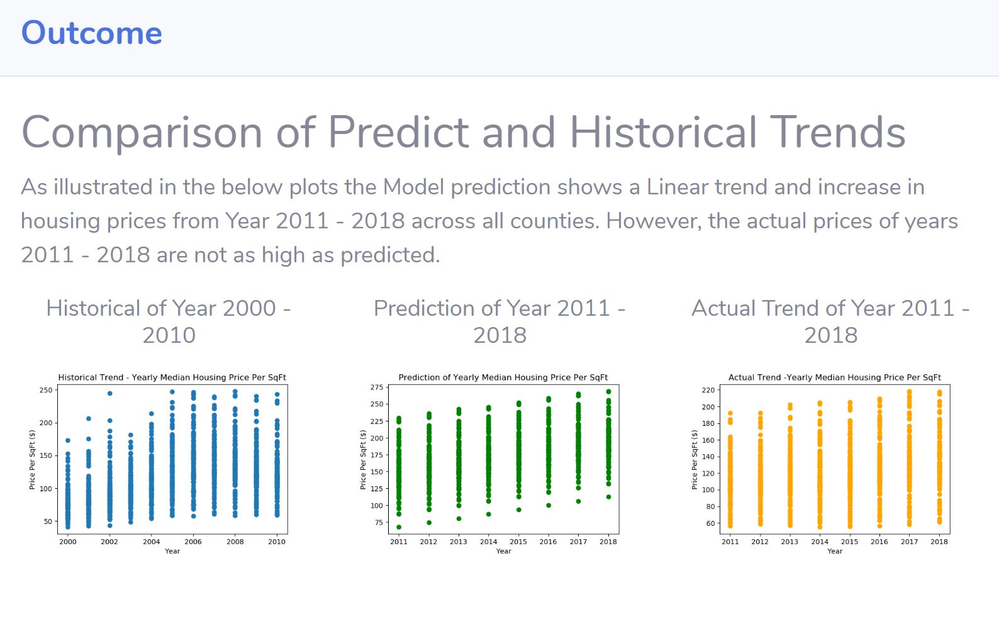
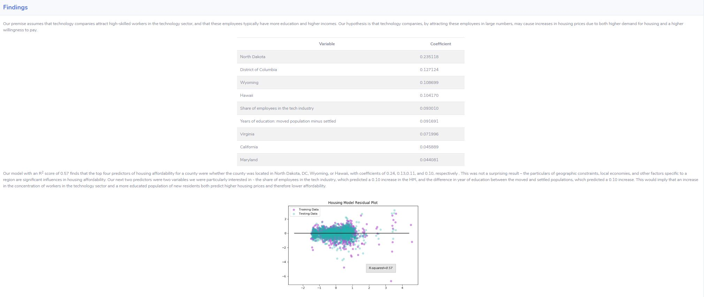

Project by: Nireesha Abbineni, Allyssa Calhoun, Emily Reynolds, Mrinmayee Kulkarni: August 24, 2019

Housing and the Technology Sector
As we prepare to welcome Amazon HQ2 to Washington D.C. and have already begun to get a glimpse of the real estate grab in Arlington, we were interested in exploring the connection between rising real estate prices and technology hubs. Below is an overview of the real estate market trends. In addition, we use machine learning models to provide insight on the interplay between the housing and technology sectors in tech hubs across the county. The factors we use to predict rises in housing prices provide insight on how Amazon and other companies might affect the real estate market in a technology sector-dependent area, like Arlington.

This full scope of this project has been deployed to Heroku @ https://housingmarket.herokuapp.com/tech_education_model

Catalog: 
Source Code for the website is under housingmarket folder
Source Code for the ML Models is under MLModels folder

Platforms utilized: Tableau, Javascript, Python, HTML, Javascript-Plotly, and Machine Learning

A brief overview of the project: 

